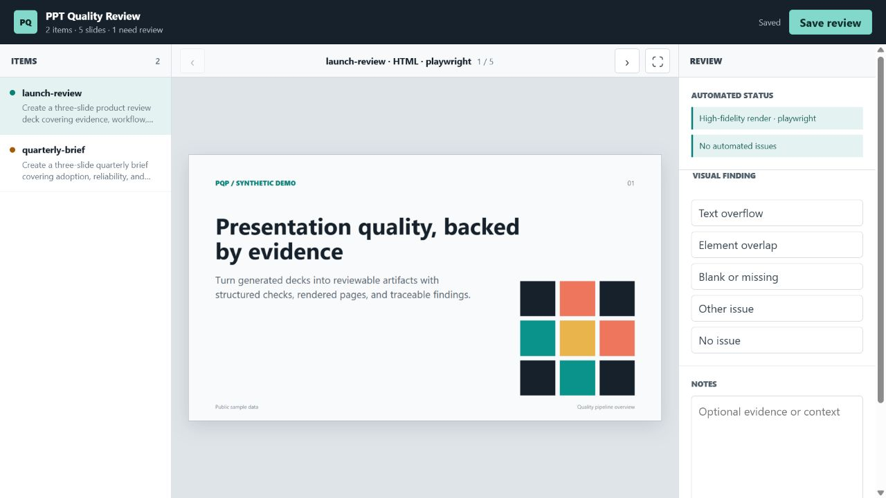
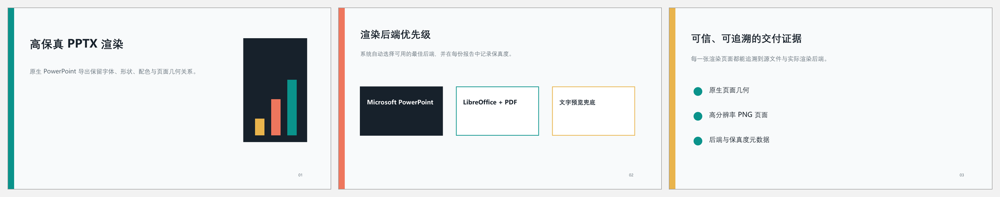

# PPT Quality Pipeline

一个可复现的演示文稿质量评估工具链，覆盖文件归档、幻灯片渲染、确定性规则检查、人工视觉标注以及 JSON、CSV、XLSX 报告导出。

**真实交付背景：本项目来源于真实的演示文稿标注交付流程，已经处理过实际标注数据，并完成过人工复核结果与结构化报告的正式交付；它不是只为展示而制作的 Demo。**

[English README](README.md)



## 项目价值

常见的 PPT 评估流程容易散落在一次性脚本、截图目录和人工表格中。本项目将它整理成可追踪的标准流程：

```text
任务 JSONL -> 产物归档 -> 页面渲染 -> 自动问题
           -> 人工标注 -> JSON / CSV / XLSX 报告
```

原始工作流实际处理了任务输入、生成式 PPT 产物、逐页质量问题、人工标注记录和最终交付报告。为保护数据方，公开仓库不包含原始演示文稿、真实标注内容、平台标识或内部采集器，而是使用合成样例复现同一套端到端处理与交付契约。

## 真实数据处理与交付

- 处理真实演示文稿标注任务，而非仅运行合成测试样例
- 对生成产物进行归档和高保真逐页渲染，形成可回溯的视觉证据
- 结合确定性规则初筛与人工逐页复核，记录超框、重叠、空白页和审阅备注
- 汇总自动检查、人工标注、渲染来源和文件溯源信息
- 以 JSON、CSV、XLSX 等结构化格式整理并完成结果交付
- 公开版本仅替换敏感数据和私有采集接口，保留真实交付流程中的核心工程能力

## 核心能力

- 为每个产物保存稳定、可审计的运行目录
- 使用 Playwright 和本机 Chrome/Chromium 渲染 HTML 幻灯片
- 在 Windows 上调用 Microsoft PowerPoint 进行高保真 PPTX 渲染
- 提供 LibreOffice 跨平台高保真后备链路
- 使用 PyMuPDF 或 Poppler 渲染 PDF
- 检查页数、必需内容、禁用内容和缺失产物
- 提供人工标注页面，记录超框、重叠、空白页和备注
- 导出 JSON、CSV 和可选 XLSX 报告
- 输出面向交付的自动检查、人工标注、渲染证据与溯源信息
- 防止误覆盖普通目录和目录穿越
- 自带完全合成的正反例 Demo 与单元测试

## 快速开始

需要 Python 3.10+、Node.js 20+ 和 Chrome、Edge 或 Chromium。高保真 PPTX 渲染还需要 Windows 上的 Microsoft PowerPoint，或跨平台的 LibreOffice。

```bash
python -m venv .venv
# Windows: .venv\Scripts\activate

python -m pip install -e ".[xlsx,pptx]"
corepack enable
pnpm install

pqp doctor
pqp demo
pqp serve --run-dir runs/demo
```

然后打开 [http://127.0.0.1:8765](http://127.0.0.1:8765)。

Demo 包含两个任务：一个通过全部自动检查；另一个故意缺少一页和一项必需内容，用来展示问题证据与人工标注流程。

## 使用自己的任务

```json
{"id":"deck-001","query":"制作一份三页评审材料","artifacts":[{"path":"deck.html","kind":"html","role":"generated"}],"expectation":{"page_count":3,"required_keywords":["证据","评审"]}}
```

```bash
pqp run --tasks tasks.jsonl --output runs/my-run
pqp serve --run-dir runs/my-run
pqp export --run-dir runs/my-run --format xlsx
```

详细字段见 [任务格式](docs/task-format.md)，实现结构见 [架构说明](docs/architecture.md)。

## 当前边界

- HTML 与图片可进行视觉渲染。
- PDF 优先使用 PyMuPDF，也可以自动调用 Poppler `pdftoppm`。
- Windows 环境优先调用 Microsoft PowerPoint，将每页导出为 1080 像素高的 PNG。
- macOS 和 Linux 可以使用 LibreOffice 转换为 PDF 后逐页渲染。
- 没有视觉后端时才使用文字预览，并在报告中明确标记为低保真。
- 本地标注服务默认只监听 `127.0.0.1`，没有身份认证，不应暴露到不可信网络。



渲染顺序、环境变量和严格模式见 [渲染后端说明](docs/rendering.md)。

## 测试

```bash
python -m ruff check src tests
python -m ruff format --check src tests
python -m unittest discover -s tests -v
pnpm run check
```

安装 Microsoft PowerPoint 的 Windows 环境可以运行原生集成检查：

```powershell
powershell -ExecutionPolicy Bypass -File scripts/verify_powerpoint_renderer.ps1
```

## 许可证

MIT
