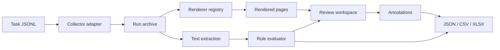

# Architecture

PPT Quality Pipeline separates evidence acquisition from evaluation so that
private collectors can be added without changing the public review workflow.

## Modules

| Module | Responsibility |
| --- | --- |
| `collector.py` | Stage local artifacts and normalize provenance. |
| `renderers.py` | Convert supported artifacts into reviewable page images. |
| `text.py` | Extract searchable text without coupling to the evaluator. |
| `evaluator.py` | Apply deterministic expectations and create evidence-backed issues. |
| `server.py` | Serve the local review workspace and persist annotations. |
| `exporter.py` | Produce portable reports for downstream analysis. |
| `pipeline.py` | Coordinate a complete, deterministic run. |

## Extension points

Collectors and renderers are intentionally narrow. A private integration can
implement its own collector and pass normalized artifacts to the same pipeline.
Public code does not need to know the source system, authentication model, or
browser profile.

The current PPTX renderer is a portable text-preview fallback. Production
deployments should register a visual-fidelity adapter backed by LibreOffice,
Microsoft PowerPoint, or a managed rendering service.
